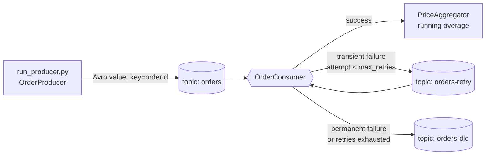

# Git Hub repo Link -

https://github.com/NirangaNiluminda/kafka-order-processing.git

# Kafka Order Processing System

A Kafka pipeline that produces and consumes **order** messages using **Avro
serialization**, with:

- **Real-time aggregation** — running average of order prices
- **Retry logic** for transient processing failures (dedicated retry topic + exponential backoff)
- **Dead Letter Queue** for permanently failed messages
- a repeatable **live demo** (see [`docs/DEMO.md`](docs/DEMO.md))

Language: **Python 3.9+** with `confluent-kafka` and `fastavro`.

---

## Requirement → implementation map

| Requirement | Implementation |
|---|---|
| Produce order messages | [`src/producer/order_producer.py`](src/producer/order_producer.py), [`run_producer.py`](run_producer.py) |
| Consume order messages | [`src/consumer/order_consumer.py`](src/consumer/order_consumer.py), [`run_consumer.py`](run_consumer.py) |
| Avro serialization (`order.avsc`) | [`src/serialization/avro_codec.py`](src/serialization/avro_codec.py), [`schemas/order.avsc`](schemas/order.avsc) |
| Real-time running average | [`src/aggregation/price_aggregator.py`](src/aggregation/price_aggregator.py) |
| Retry logic for transient failures | [`src/consumer/retry_handler.py`](src/consumer/retry_handler.py) + `orders-retry` topic |
| Dead Letter Queue | [`src/consumer/dlq_handler.py`](src/consumer/dlq_handler.py) + `orders-dlq` topic |
| Live demonstration | [`docs/DEMO.md`](docs/DEMO.md), optional `kafka-ui` at `:8080` |

---

## Order message schema (`schemas/order.avsc`)

| Field | Avro type | Description |
|---|---|---|
| `orderId` | `string` | Unique identifier for the order (e.g. `"1001"`) |
| `product` | `string` | Name of the purchased item (e.g. `"Laptop"`) |
| `price` | `float` | Price of the product (randomized) |

Messages are encoded with fastavro's **schemaless** binary writer. There is no
Schema Registry: the producer and consumer both load the same `.avsc` file, so
the reader schema always matches the writer schema. The Kafka message **key** is
the `orderId` (for partition affinity); the **value** is the Avro payload.

---

## Architecture



### Processing pipeline (per message)

1. If the message is a retry that is **not yet due** (`not_before` header), wait.
2. **Avro-decode** the value — on failure → DLQ (`avro decode failed`).
3. **Build & validate** the `Order` — empty `product` / negative `price` → DLQ
   (`order validation failed`).
4. **Classify** the outcome ([`FailureSimulator`](src/consumer/failure_simulator.py)):
   - **SUCCESS** → `PriceAggregator.add(price)`, log the running average.
   - **TRANSIENT** → if attempts remain, re-publish to `orders-retry` with
     `retry_count + 1` and a `not_before` timestamp; otherwise → DLQ
     (`max retries exceeded`).
5. **Commit** the source offset (manual, synchronous, only after step 4 resolves).

### Failure simulation

This project has no real downstream service to fail, so failures are simulated
deterministically for the demo:

- **Poison messages** — the producer's `--poison-rate` emits structurally-valid
  Avro that fails `Order` validation (negative price or empty product). These are
  *permanent* → straight to the DLQ.
- **Flaky messages** — the producer's `--flaky-rate` tags messages with an
  `x-fail-times: N` header; the consumer fails them *transiently* on their first
  `N` attempts, then succeeds. These travel through `orders-retry`.
- A baseline random transient rate is also available (`--transient-rate` /
  `consumer.transient_failure_rate`).

### Retry backoff

For the *n*-th attempt (1-based):

```
delay = initial_delay_seconds * (backoff_multiplier ** (n - 1))     # capped at max_delay_seconds
```

Defaults (`config/settings.yaml`): `1s → 2s → 4s`, then DLQ after `max_retries = 3`.

### Design notes & trade-offs

- **Retry topic vs in-process retry.** Re-publishing to `orders-retry` keeps
  failures off the main partition and preserves ordering guarantees for healthy
  traffic. The consumer honours the backoff by sleeping until `not_before` when
  it reads a retry record; because the same consumer reads the retry topic, a
  long backoff still briefly blocks that partition. A fully non-blocking design
  would use tiered delay topics (`orders-retry-1s`, `-5s`, …) or an external
  scheduler — out of scope here.
- **Delivery semantics: at-least-once.** The retry/DLQ producer is flushed
  before the source offset is committed. A crash in that window re-processes the
  source message (possible duplicate retry record). Consumers of `orders-dlq`
  should be idempotent.
- **Aggregation scope.** `PriceAggregator` is in-memory and owned by one
  consumer instance. Scaling to multiple consumers would need a shared store
  (Redis/DB) or Kafka Streams with a state store.

---

## Project structure

```
kafka-order-processing/
├── docker-compose.yml           # Kafka + Zookeeper (+ optional kafka-ui), topic init
├── requirements.txt / requirements-dev.txt
├── Makefile                     # task runner: install / ui / produce / consume / down ...
├── pytest.ini
├── schemas/order.avsc           # Avro schema for order messages
├── config/settings.yaml         # all tunables
├── src/
│   ├── config.py                # YAML → typed dataclasses
│   ├── models/order.py          # Order domain model + validation
│   ├── serialization/avro_codec.py
│   ├── aggregation/price_aggregator.py
│   ├── producer/order_producer.py
│   └── consumer/
│       ├── order_consumer.py    # the pipeline above
│       ├── failure_simulator.py # SUCCESS / TRANSIENT classification
│       ├── retry_handler.py     # exponential backoff + retry-topic publish
│       ├── dlq_handler.py       # DLQ publish + failure-metadata headers
│       └── headers.py           # Kafka header helpers
├── tests/                       # pytest unit tests (no Kafka needed)
├── run_producer.py
└── run_consumer.py
```

---

## Quick start (via `make`)

Everything runs through `make` — no `docker` or `python` commands to remember.
Run `make` on its own for the full target list, `make doctor` to check your setup.

```bash
make install          # 1. build the virtualenv (~/.venvs/) + install deps
make ui               # 2. start Kafka + Zookeeper + kafka-ui (:8080), create topics

make consume          # 3a. terminal A — the pipeline
make produce N=30 FLAKY=0.3 POISON=0.2   # 3b. terminal B — send orders

make down             # 4. stop everything  (make reset = also wipe topics)
```

`Ctrl-C` the consumer to print the aggregation summary.
Full narrated walkthrough: **[`docs/DEMO.md`](docs/DEMO.md)**.

### `make` targets

| Target | Does |
|---|---|
| `install` / `reinstall` | create / rebuild the virtualenv and install dependencies |
| `test` | run the unit suite (`pytest`) |
| `ui` (`start`) | start Kafka + Zookeeper + kafka-ui at <http://localhost:8080> |
| `up` | start Kafka + Zookeeper only |
| `stop` / `down` / `reset` | pause / remove containers / remove + wipe all data |
| `restart` | recreate the stack cleanly (fixes stale container/network errors) |
| `produce` | send orders — vars `N POISON FLAKY INTERVAL` (e.g. `make produce N=100`) |
| `consume` | run the consumer |
| `dlq` | dump the Dead Letter Queue with headers |
| `topics` / `groups` / `logs` | inspect topics / consumer-group lag / broker log |
| `demo` | start the stack and fire a mixed batch in one command |
| `doctor` | check docker, compose and the virtualenv are usable |

The virtualenv lives **outside** the repo (`~/.venvs/kafka-order-processing`) because
this tree is on a `noexec` mount; override with `make <target> VENV=/path`.

### Manual equivalents

<details><summary>without <code>make</code></summary>

```bash
docker compose --profile tools up -d
python3 -m venv ~/.venvs/kop && ~/.venvs/kop/bin/python -m pip install -r requirements-dev.txt
~/.venvs/kop/bin/python run_consumer.py
~/.venvs/kop/bin/python run_producer.py --count 30 --flaky-rate 0.3 --poison-rate 0.2
docker compose --profile tools down -v
```
</details>

---

## Configuration (`config/settings.yaml`)

| Key | Meaning |
|---|---|
| `kafka.bootstrap_servers` | broker address (`localhost:9092`) |
| `topics.{orders,retry,dlq}` | topic names |
| `producer.start_order_id` | first `orderId` (incremented per message) |
| `producer.price_range` / `producer.products` | random order generation |
| `producer.poison_rate` / `producer.flaky_rate` | default failure-injection rates |
| `consumer.transient_failure_rate` | baseline random transient-failure probability |
| `retry.max_retries` | attempts before a message goes to the DLQ |
| `retry.initial_delay_seconds` / `backoff_multiplier` / `max_delay_seconds` | backoff curve |

CLI flags on `run_producer.py` / `run_consumer.py` override the file.

---

## CLI reference

```
run_producer.py  --count N  --interval S  --poison-rate 0..1  --flaky-rate 0..1  --bootstrap HOST:PORT
run_consumer.py  --group ID  --transient-rate 0..1  --bootstrap HOST:PORT
```

---

## Tests

```bash
make test
```

Covers the Avro codec (round-trip + malformed input), the aggregator math, the
retry backoff curve and boundary, the failure-simulator determinism, the domain
model validation, and config loading. No running Kafka required.

---

## Inspecting topics manually

```bash
# Dead Letter Queue, with failure headers
docker exec -it kafka kafka-console-consumer --bootstrap-server localhost:9092 \
  --topic orders-dlq --from-beginning --property print.headers=true

# list topics / describe consumer group   (or: make topics / make groups)
docker exec -it kafka kafka-topics --bootstrap-server localhost:9092 --list
docker exec -it kafka kafka-consumer-groups --bootstrap-server localhost:9092 \
  --describe --group order-processing-group
```

Or use the web UI: `make ui` → <http://localhost:8080>.
